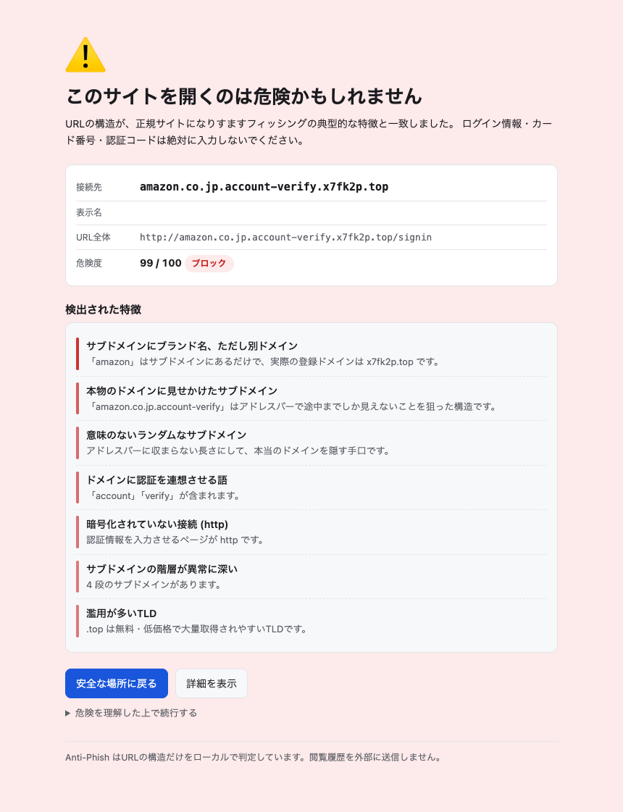

# Moribito

A Chrome extension (Manifest V3) that detects phishing sites **entirely on your device** and
replaces navigation to dangerous pages with a warning screen.
It never sends the URLs you visit, or the content of the pages you view, to any server.



## What this actually is

Being explicit up front, because it is easy to assume otherwise:

- **No LLM is used.** No inference runs at all.
- **No machine-learning model is bundled.** `extension/model/` contains only a README.
- **No hosted model is called unless you turn one on.** One optional layer (Jev) can query an
  external API at runtime; it is **off by default**, needs an API key, and sends only the hostname
  unless you choose otherwise. With default settings the extension makes zero network requests to judge a page.

Everything it currently does is deterministic:

1. Rules over the URL string (Unicode normalization, Public Suffix List, edit distance)
2. Hash comparison against a pre-distributed list (the bundled list ships empty)
3. Matching of author-written DOM attributes and a closed brand dictionary

Plug points for a local classifier and a local text model exist and are wired into the
pipeline, but they are **disabled by default and return nothing unless you inject a model**.
See [Local models](#local-models-optional).

## Requirements

| | |
|---|---|
| Browser | Chromium-based, **Chrome 116+** (needs `chrome.offscreen` with the `WORKERS` reason, and `chrome.scripting`) |
| OS | Any (it is a browser extension) |
| Extension format | Manifest V3 |
| For development | Node.js 20+ (verified on 22), Playwright (fetches its own Chromium) |
| Optional | onnxruntime-web + an ONNX model — everything works without them |

**Firefox and Safari are not supported as-is.** The detection core (`src/core/`) has no
dependency on browser APIs and is portable, but Firefox has no equivalent of
`chrome.offscreen`, so the worker host would need to be swapped.

### Install

```bash
npm install
npm test
```

1. Open `chrome://extensions`, enable Developer mode
2. "Load unpacked" → select the `extension/` directory

## Architecture

Detection is split into layers so that **the cheapest, most deterministic checks decide first**.

```
  Navigation starts (webNavigation.onBeforeNavigate)
      │
      ├─▶ allow   User allowlist                        → pass through
      ├─▶ list    Hash comparison with known-phishing list
      ├─▶ safe    Official brand / popular domain / LAN  → stop here
      ├─▶ url     URL structure rules (22 signals, ~0.2ms, synchronous)
      │              └─ score ≥ 0.85 → replace the tab with the warning screen
      ├─▶ reputation  External lookup (disabled by default)
      │
      ▼  After the DOM is parsed (webNavigation.onDOMContentLoaded)
      ├─▶ content  Inspect the rendered page (two-stage, see below)
      └─▶ model    Local classifier / local text model (disabled by default)

      Re-evaluated on `focusin` as well, to catch forms injected after load.
```

### Pluggable detectors

Each layer is a **detector** that can be added, removed or replaced. The pipeline
(`src/core/pipeline.js`) only decides *when to run whom, how to combine, and where to stop*.

```js
{
  id, label, description,
  stage,                       // allow → list → safe → url → reputation → content → model
  cost: { network, latency },  // the settings page renders this verbatim
  defaultEnabled,
  runWhen(state),              // e.g. only when the score is in the grey band
  run(ctx, state)              // => { signals } or { decision } (decision stops the pipeline)
}
```

| Detector | Stage | Network | Default |
|---|---|---|---|
| `allowlist` — user allowlist | allow | none | on |
| `blocklist` — local hash comparison | list | none | on |
| `known-good` — official / popular / LAN cutoff | safe | none | on |
| `url-rules` — URL structure rules | url | none | on |
| `reputation` — external reputation lookup | reputation | **yes** | **off** |
| `jev-remote` — probability model via external API | reputation | **yes** | **off** |
| `page-evidence` — rendered page inspection | content | none | on |
| `local-model` — local URL classifier | model | none | **off** (no model bundled) |
| `local-text-model` — local text model | model | none | **off** (no model bundled) |

Detectors know nothing about `chrome.*`. Everything external is injected through
`ctx.services` (`blocklist`, `fetchImpl`, `classifyUrl`, `classifyText`, `cache`),
which is why they can be tested from Node with models and APIs swapped out:

```js
await runDetection(
  { url, features, evidence, services: { classifyText: async () => ({ probability: 0.9 }) } },
  resolveDetectors(DETECTOR_CATALOG, { 'local-text-model': { enabled: true } }),
);
```

Adding a new kind of detection means adding one entry to `src/core/detectors/index.js`.
The settings page, the score combination and the tests pick it up automatically.

### Why an offscreen document

MV3 service workers cannot call `new Worker()`, and they are terminated when idle —
so a model held in the worker would be reloaded constantly. The worker therefore lives in an
**offscreen document**, which the service worker talks to by message.

### Layout

```
extension/
  src/core/         detection logic — no chrome.* dependency, runs under Node as-is
    punycode.js       RFC 3492 decoder
    unicode.js        script detection, invisible characters, BiDi, display sanitization
    confusables.js    folding look-alike characters to an ASCII skeleton
    psl.js            Public Suffix List
    brands.js         brand dictionary (46 brands, with Japanese aliases)
    features.js       URL → features
    rules.js          features → signals
    page-evidence.js  page content → signals
    blocklist.js      hashed list comparison
    reputation.js     vendor-neutral external lookup layer
    pipeline.js       detector registry and staged execution
    detectors/        the detector catalog
  src/background/   service worker
  src/content/      page-probe.js (injected on demand)
  src/offscreen/    worker host
  src/worker/       detection worker + ONNX plug point
  src/ui/           warning screen / popup / settings
tools/              PSL, confusables, blocklist builders; evaluation; distillation pipeline
tests/              unit (Node) + e2e (Playwright, headless Chromium)
```

## What it looks at

### URL structure (22 signals)

| Detection | Example |
|---|---|
| Homoglyphs (fold to an ASCII skeleton, compare against real brand domains) | `xn--80ak6aa92e.com` → `аррӏе.com` → `apple.com` |
| Mixed scripts, per label | `pаypal.com` (а is U+0430) |
| Digit and multi-character tricks | `arnazon.co.jp` (rn→m), `g00gle.com` |
| Zero-width characters, BiDi controls, period look-alikes | `goo<U+200B>gle.com`, `example。com` |
| Typosquatting (edit distance 1–2) | `mercarl-jp.shop` |
| Brand name only in the subdomain | `amazon.co.jp.verify.x7fk2p.top` |
| A public suffix faked inside the subdomain | `co.jp` appearing on the subdomain side |
| Long random subdomains, machine-generated domain names | entropy + consonant runs |
| Free hosting plus a brand name | `rakuten-card-login.pages.dev` |
| `@` host spoofing, raw IPs, odd ports, heavily abused TLDs | `http://apple.com@203.0.113.9/` |

### Page content (two stages)

Stage 1 collects **any form with a visible input**, not just `input[type=password]` —
restricting to password fields misses card-number theft, OTP theft and multi-step phishing.
Stage 2 scores what is actually being asked for.

| Evidence | Weight |
|---|---|
| `type=password`, `autocomplete=cc-number,cc-csc,current-password` | strong (standards-based, not name guessing) |
| Vocabulary match (card number, PIN, security code, account number, My Number — Japanese included) | strong–medium |
| Four or more single-digit inputs in a row (OTP) | medium |
| Recovery phrase / private key input | strong |
| Form posts to another domain, or sends credentials over GET | strong |
| Brand claimed by `<title>` / `og:site_name` / logo alt vs. the registrable domain | strong |
| Phone lure plus exit traps (fullscreen, unload warning, autoplay audio) | strong — tech-support scams |
| **Search-box-like form** | **penalty** (`role=search`, `name=q`, placeholder) |

"Sign in with Google" style button text is **not** treated as a brand claim — legitimate sites show it too.

**Natural-language judgement was removed.** A fixed phrase list was measured and it missed every
paraphrase, missed English and Chinese entirely, and fired on a real bank's genuine security notice.
String matching does not do NL classification; tech-support scams are now detected structurally instead.
See [docs/security-review.md](docs/security-review.md) finding 10.

### Keeping false positives down

- Official brand domains (46 brands) and popular domains are never judged
- Private IPs, `localhost` and `*.local` are out of scope (router admin pages)
- Real brands one edit apart (`paypal` / `paypay`) are not treated as typos of each other
- Common English words (`finance`, `service`, `monthly`) are excluded from typo candidates
- The user allowlist takes precedence over everything

Scores combine with **noisy-OR**: weak evidence accumulates but never exceeds 1.

## External data and APIs

**At runtime the only network request this extension makes is fetching the known-phishing list
from an update URL you configure.** It is off by default.

| When | Destination | What is sent | Default |
|---|---|---|---|
| Opening a page | **nothing** | — | — |
| Grey-band URL, if Jev is enabled | TypeSafe AI | the hostname (or the URL, if you opt in) | **off** |
| Grey-band URL, if a reputation provider is enabled | the endpoint you configured | depends on the provider kind | **off** |
| List update (every 12h) | only the URL you configured | nothing (GET only) | off (no URL set) |
| Building a list (development) | the feeds you name | nothing | manual |

### Feeds that can be compiled into the list

`tools/build-blocklist.mjs` accepts OpenPhish, PhishTank, URLhaus, and any plain URL list —
including private feeds your organisation receives, passed as a local file so they never leave the machine.
Only the **first 64 bits of a SHA-256 hash** end up in the artifact; the original URLs do not.

Widening to host or domain level automatically excludes shared hosting (`pages.dev` and friends),
popular domains and official brand domains, so a compromised page on a legitimate site does not
take down the whole site.

```bash
node tools/build-blocklist.mjs \
  --source=openphish:https://openphish.com/feed.txt \
  --source=plain:./data/private-feed.txt \
  --out=extension/data/blocklist.json --ttl-days=14
```

> Check each feed's terms yourself — redistribution rights vary.
> **JC3 (Japan Cybercrime Control Center) has no public feed**; members can pass their file via `plain:`.

### External reputation lookup (off by default)

A vendor-neutral provider layer: the endpoint and the way to read the response are both configuration.

| Kind | What is sent | Load | Default |
|---|---|---|---|
| `prefix` — k-anonymous hash prefix lookup | only a hash prefix, never the URL | low | off |
| `domain` — domain reputation API | the domain (the site you are visiting is disclosed) | high | off |
| `ip` — IP reputation API | an IP resolved over DoH (the resolver also learns the site) | high | off |

Only pages that the URL rules could not settle are looked up, results are cached per domain for
6 hours, and a failing provider never blocks a verdict (2.5s timeout with `AbortController`).

### Jev (TypeSafe AI) — the one runtime API call, off by default

When enabled, grey-band URLs are sent to Jev's `POST /v1/systemone` as a typed `choice` question,
and the returned probability becomes one more signal.

| | |
|---|---|
| What is sent | **the hostname only** by default; path and query only if you opt in |
| When | only URLs the rules could not settle — not every page |
| Weight | capped at 0.8, so it never blocks on its own; combined with the grey score it can |
| API key | stored in `chrome.storage.local`, **never** in `storage.sync` (which syncs to Google), and never returned to the UI |
| Failure | a timeout, 401/422/429/529 or a malformed response leaves the rule verdict untouched |
| Caching | per hostname, 6 hours |

### Certificates

**Chrome extensions cannot read TLS certificates** — there is no equivalent of Firefox's
`webRequest.getSecurityInfo()`. Also, a DV certificate is not a red flag by itself, since most
legitimate sites use one. The workable route is Certificate Transparency: collect newly issued
certificates containing brand keywords ahead of time and ship them like the blocklist. Not implemented.

## Local models (optional)

**No model is bundled.** A hostname classifier was trained on PhiUSIIL and then rejected:
it scored AUC 0.94 on a domain-disjoint split, yet flagged `github.com`, `docs.google.com`
and `wikipedia.org` as phishing. The dataset's benign side is `www.`-prefixed home pages of
obscure sites, so the model had learned "starts with `www.` = legitimate" and
"short famous domain = anomalous". Adding 150k top-sites as benign fixed those specific
false positives but dropped held-out AUC to 0.73 with a 3.4% false-positive rate — too high
for an always-on tool. The full write-up is in [docs/evaluation.md](docs/evaluation.md).

What ships instead is the machinery, so the attempt can be repeated with better data:

| | |
|---|---|
| `src/core/url-classifier.js` | inference — hashed char n-grams, dot product, sigmoid. No ONNX, no WASM, ~256KB of int8 weights |
| `tools/train/train-url-classifier.mjs` | training, Node only. `--scope` and `--benign-list` switch the variants |
| `tools/train/validate-url-classifier.mjs` | **the shipping gate**: exits non-zero if a single legitimate site is flagged |

The lesson worth carrying: a split of the same dataset — even a domain-disjoint one — cannot
decide whether a model is shippable. The dataset's own quirks live on both sides of the split.

Drop an ONNX model into `extension/model/` instead and the grey band gets a second opinion
on-device. Build instructions are in `tools/train/README.md`.

Because nothing is sent to a hosted model at runtime, a hosted probability model is only used
**at development time, as the teacher for distillation**:

```
dataset → label with a hosted model (once, offline) → train a small classifier
        → export to ONNX → extension/model/ → inference on-device, grey band only
```

`tools/train/label_with_jev.mjs` is the plug point for that step. It is an **unexecuted
placeholder** — the request and response shapes must be adjusted to the actual API.

## Privacy

| Data | Where it lives | Sent anywhere |
|---|---|---|
| URLs you visited | in-memory cache, max 500 entries, gone when the worker stops | **no** |
| Page content | scored immediately, then discarded | **no** |
| Verdicts | `storage.session`, cleared when the browser closes | **no** |
| Settings and allowlist | `storage.sync` | **no** (subject to Chrome's own sync) |
| Counters | `storage.sync`, counts only | **no** |

When collecting page evidence, values the user typed are **never read**. Only author-written
attributes (name / placeholder / label / autocomplete), the title, and the first 1500 characters
of body text.

## Accuracy

Measured against PhiUSIIL (UCI, 235,795 URLs) using the URL rules alone:

| Threshold | Precision | Recall | False-positive rate |
|---|---|---|---|
| 0.55 (warn) | 98.4% | 10.0% | 0.12% |
| **0.85 (block)** | **99.9%** | **2.1%** | **0.0015%** (2 of 134,850) |

Precision is very high; recall on a general corpus is low **by design**. Most phishing URLs in that
corpus carry no brand impersonation at all (`http://www.f0519141.xsph.ru`) and are structurally
indistinguishable from unknown legitimate sites. That is exactly why the list layer and the content
layer exist. Full interpretation, including the limits of this measurement, is in
[docs/evaluation.md](docs/evaluation.md).

## Security

A review against OWASP ASVS v4.0.3 was carried out; 9 findings (2 High) were fixed, and
regression tests carry the ASVS chapter numbers. Report: [docs/security-review.md](docs/security-review.md).

The High-severity ones are worth noting because they are specific to this kind of tool:

- The warning screen embedded a page-controlled hostname **including BiDi control characters** —
  an anti-phishing tool letting an attacker rewrite its own warning text
- "Proceed anyway" trusted the hostname supplied in the message, rather than the record the
  service worker itself stored

## Testing

```bash
npm run test:unit   # detection logic, under Node
npm run test:e2e    # the real extension loaded into headless Chromium, via Playwright
npm test            # both
```

The e2e suite loads the extension into a real Chromium, and verifies that navigation is replaced
by the warning screen, that the offscreen worker responds, that content inspection stops a grey URL,
that `focusin` catches late-injected forms, that settings changes reach the verdict, and that
**no external request is made with the default settings**. All http(s) traffic is stubbed locally.

> MV3 extensions do not run in the headless shell, so e2e launches `channel: 'chromium'`.
> Right after `--load-extension` the service worker has not activated and webNavigation events are
> not delivered, so the fixtures wait for readiness.

## Tools

```bash
node tools/build-psl.mjs           # refresh the Public Suffix List
node tools/build-confusables.mjs   # regenerate the confusables table from unicode.org
node tools/build-blocklist.mjs     # compile feeds into a hashed list
node tools/make-icons.mjs          # generate icons
node tools/evaluate.mjs data/your-set.csv --sweep
```

## Known limits

- Forms inside cross-origin iframes cannot be read (a browser restriction)
- Input that never reaches the DOM (canvas-drawn keypads) is invisible to it
- Short URLs are not expanded (that would require an external request)
- Certificate contents are not inspected (no extension API for it)
- The bundled PSL is a subset; run `tools/build-psl.mjs` for full accuracy
- Impersonation of brands outside the dictionary is only caught structurally
- The bundled blocklist is empty — you supply the feed

## Under consideration

- A Certificate Transparency derived "new certificate × brand keyword" list
- Replacing removed phrase matching with a real text classifier (plug point exists, model does not)
- Firefox / Safari support (`src/core/` is portable; the worker host is not)

---
---

# Moribito（日本語）

フィッシングサイトを**端末内だけで**判定し、危険なページへの遷移を警告画面に差し替えるMV3拡張。
閲覧中のURLやページ内容を外部サーバーへ送信しません。


---

## 1. 動作環境

| 項目 | 要件 |
|---|---|
| ブラウザ | Chrome / Edge など Chromium系、**Chrome 116以降**（`chrome.offscreen` の `WORKERS` 理由と `chrome.scripting` を使うため） |
| OS | macOS / Windows / Linux（ブラウザ拡張なのでOS非依存） |
| 拡張形式 | Manifest V3 |
| 開発時 | Node.js 20以上（22で検証）、Playwright（E2E用にChromiumを自動取得） |
| 任意 | onnxruntime-web + 学習済みONNXモデル（無くても全機能が動く） |

**Firefox / Safari は現状そのままでは動きません。** 判定の中核（`src/core/`）は
ブラウザAPIに一切依存しない素のJavaScriptなので移植可能ですが、
`chrome.offscreen` に相当するものがFirefoxに無いため、ワーカーの置き場所だけ差し替えが必要です。

### 導入

```bash
npm install
npm test
```

1. `chrome://extensions` を開く → 「デベロッパーモード」をON
2. 「パッケージ化されていない拡張機能を読み込む」で `extension/` を選ぶ

---

## 2. アーキテクチャ概要

判定を4つの層に分け、**確定的に判定できるものほど手前で、安く決着させる**構成です。

```
  遷移発生 (webNavigation.onBeforeNavigate)
      │
      │  ┌─────────────────────────────────────────────┐
      ├─▶│ 層0: 打ち切り                                 │  許可リスト / 公式ブランドドメイン
      │  │      → 判定せず通過                           │  / 著名ドメイン / 社内LAN・localhost
      │  └─────────────────────────────────────────────┘
      │
      │  ┌─────────────────────────────────────────────┐
      ├─▶│ 層1: 既知リスト照合（ハッシュ突き合わせ）        │  SHA-256の先頭64bitで
      │  │      URL一致 0.99 / ホスト 0.97 / ドメイン 0.95 │  端末内だけで照合
      │  └─────────────────────────────────────────────┘
      │
      │  ┌─────────────────────────────────────────────┐
      ├─▶│ 層2: URL構造ルール（同期・0.2ms）              │  ホモグリフ / 混在スクリプト
      │  │      22種の信号を noisy-OR で合成              │  / ブランド詐称サブドメイン ほか
      │  └─────────────────────────────────────────────┘
      │           │
      │           ├─ score ≧ 0.85 → 警告画面に差し替え（ここで終了）
      │           │
      │           └─ 0.35 ≦ score < 0.90（グレー）
      │                 └─▶ 層3: ローカル軽量分類器（任意・offscreen上のWorker）
      │
      ▼  DOM構築後 (webNavigation.onDOMContentLoaded)
  ┌───────────────────────────────────────────────────┐
  │ 層4: 表示コンテンツ検査（層0で打ち切られていない場合のみ）│
  │   1段目 可視の入力欄を持つフォームがあるか              │
  │   2段目 何を要求しているか／どのブランドを名乗るか       │
  │   → ブロック相当なら警告画面、警告相当なら画面上部にバー  │
  └───────────────────────────────────────────────────┘
      ▲
      └─ 入力欄への focusin でも再評価（後から差し込まれるフォーム対策）
```

### 差し替え可能な検出器（detector）

判定は**段階（stage）ごとに実行される検出器の集まり**で、追加・削除・差し替えができます。
「どう判定するか」は各検出器が持ち、パイプライン（`src/core/pipeline.js`）は
「いつ誰を動かし、どう合成し、どこで打ち切るか」だけを持ちます。

```js
{
  id, label, description,
  stage,                       // allow → list → safe → url → reputation → content → model
  cost: { network, latency },  // 設定画面はこれを見て「外部通信あり」等を表示する
  defaultEnabled,
  runWhen(state),              // 例: グレーのときだけ動く
  run(ctx, state)              // => { signals } または { decision }（decisionで打ち切り）
}
```

| 検出器 | stage | 通信 | 既定 |
|---|---|---|---|
| `allowlist` 利用者の許可リスト | allow | なし | 有効 |
| `blocklist` 既知リスト照合 | list | なし | 有効 |
| `known-good` 公式・著名ドメインの打ち切り | safe | なし | 有効 |
| `url-rules` URL構造ルール | url | なし | 有効 |
| `reputation` 外部リピュテーション照会 | reputation | **あり** | **無効** |
| `jev-remote` Jevによる確率判定（外部API） | reputation | **あり** | **無効** |
| `page-evidence` 表示コンテンツ検査 | content | なし | 有効 |
| `local-model` ローカル分類器（URL） | model | なし | **無効**（モデル未同梱） |
| `local-text-model` ローカルLLM/文面判定 | model | なし | **無効**（モデル未同梱） |

検出器は `chrome.*` を知りません。外部とのやり取りは `ctx.services` で注入します
（`blocklist` / `fetchImpl` / `classifyUrl` / `classifyText` / `cache`）。
おかげで Node のテストから、モデルや外部APIを差し替えてそのまま検証できます。

```js
// 例: ローカルLLMを差し替えて試す
await runDetection(
  { url, features, evidence, services: { classifyText: async (t) => ({ probability: 0.9 }) } },
  resolveDetectors(DETECTOR_CATALOG, { 'local-text-model': { enabled: true } }),
);
```

新しい判定を足したいときは、`src/core/detectors/index.js` のカタログに1つ追加するだけです。
設定画面の一覧も、しきい値合成も、自動的にその検出器を含みます。

### なぜ offscreen document を使うのか

MV3の service worker には2つの制約があります。

1. `new Worker()` が使えない
2. 一定時間で終了する（モデルを持たせると毎回ロードし直しになる）

そのため **offscreen document を Worker のホスト**にし、service worker からメッセージで呼びます。
service worker が死んでも offscreen 側は残るので、モデルのロードコストを繰り返し払いません。

### ディレクトリ

```
extension/
  manifest.json
  src/core/          判定ロジック。chrome.* に依存せず、Nodeでもそのまま動く＝テストしやすい
    punycode.js        RFC 3492 デコーダ
    unicode.js         スクリプト判定 / 不可視文字 / BiDi
    confusables.js     見た目の骨格(skeleton)への畳み込み
    psl.js             Public Suffix List による登録ドメイン抽出
    brands.js          ブランド辞書（46件・日本語エイリアス付き）
    features.js        URL → 特徴量
    rules.js           特徴量 → 危険信号
    page-evidence.js   表示コンテンツ → 危険信号
    blocklist.js       既知リストのハッシュ照合
    score.js           noisy-OR 合成としきい値
    analyze.js         入口（URLのみ / ページ証拠込み / モデル込み）
  src/background/    service worker: 遷移の監視・ブロック・リスト更新
  src/content/       page-probe.js（必要なページにだけ注入する証拠収集＋警告バー）
  src/offscreen/     Worker のホスト
  src/worker/        判定ワーカー + ONNXモデルの差し込み口
  src/ui/            警告画面 / ポップアップ / 設定
  data/              配布された既知リスト（ハッシュのみ）
tools/               PSL・confusables・ブロックリスト生成、精度評価、蒸留パイプライン
tests/               ユニット(Node) + E2E(Playwright/ヘッドレスChromium)
```

---

## 3. 内部で使っている技術

### 標準仕様

| 仕様 | 用途 |
|---|---|
| **Unicode UTS #39** (confusables / mixed-script) | `pаypal.com`（аがキリル文字）のような字形偽装の検出 |
| **RFC 3492 (Punycode)** | `xn--80ak6aa92e.com` → `аррӏе.com` の復元。自前実装 |
| **Unicode NFKC / NFKD** | 全角・合字・結合文字の正規化 |
| **Public Suffix List** | `login.amazon.co.jp.verify.top` の実体が `verify.top` だと判定する |
| **RFC 6454 (Origin)** | フォームの送信先が別オリジンかの判定 |
| **WHATWG URL** | ブラウザ本体と同じ解釈でURLを分解（自前パーサを持たない） |
| **Web Crypto (SHA-256)** | 既知リストのハッシュ照合 |
| **Shadow DOM** | 警告バーをページ側CSSから隔離 |
| **HTML autocomplete属性** | `type=text` でも `autocomplete="cc-number"` から用途を判別 |

### Chrome拡張API

| API | 用途 | 権限 |
|---|---|---|
| `chrome.webNavigation` | 遷移直前(`onBeforeNavigate`)と DOM構築後(`onDOMContentLoaded`)の検査 | `webNavigation` |
| `chrome.scripting` | グレー判定のページにだけ証拠収集スクリプトを注入 | `scripting` |
| `chrome.offscreen` | Worker のホスト（MV3のSWはWorkerを作れない） | `offscreen` |
| `chrome.storage` | 設定(`sync`) / 既知リスト(`local`) / 一時的な判定結果(`session`) | `storage` |
| `chrome.alarms` | 既知リストの定期更新（更新元URLを設定した場合のみ） | `alarms` |
| `host_permissions: http/https` | webNavigationイベントの受信と、危険なタブの差し替え | — |

### 判定アルゴリズム

- **noisy-OR** によるスコア合成: `p ← p + w(1-p)`。弱い証拠が積み重なると上がるが1を超えない
- **編集距離（上限付き）** によるタイポスクワット判定
- **シャノンエントロピー** によるランダム生成ドメイン/サブドメインの判定
- **二分探索** による64bitハッシュ表の照合（BigInt を使わず hi/lo の2語で比較）

### 任意（同梱していない）

- **ONNX Runtime Web** + 文字レベルCNN: グレーゾーンの補助判定。
  `extension/model/` にモデルを置いたときだけ有効になり、無ければルールのみで動きます。

---

## 4. 外部のDB・API — 何がどこへ通信するか

**この拡張が実行時に行う通信は、利用者が設定した「既知リストの更新元」への取得だけです。**
閲覧中のURL・ページ内容・判定結果はどこにも送信しません。

| いつ | 通信先 | 送るもの | 既定 |
|---|---|---|---|
| ページを開くたび | **なし** | — | — |
| グレーのURL（Jev有効時） | TypeSafe AI | ホスト名（設定によりURL全体） | **既定で無効** |
| グレーのURL（リピュテーション有効時） | 設定したエンドポイント | 種別による | **既定で無効** |
| 既知リストの更新（12時間ごと） | 設定画面で指定したURLのみ | なし（GETのみ） | **未設定＝通信しない** |
| 開発時のリスト生成 | 指定したフィード | なし | 手動実行 |

### 既知リストに取り込めるフィード（`tools/build-blocklist.mjs`）

| ソース | 形式 | 備考 |
|---|---|---|
| OpenPhish community feed | `openphish:` | 無償枠あり。利用条件は提供元の規約に従うこと |
| PhishTank | `phishtank:` | CSV。APIキー・利用条件の確認が必要 |
| URLhaus (abuse.ch) | `urlhaus:` | マルウェア配布URL中心 |
| 組織で受け取っている非公開フィード | `plain:` / `json:` | **ローカルファイルとして渡す**。ネットワークに出ない |
| 任意のURLリスト | `plain:` | 自組織のブランド監視結果など |

生成物に残るのは **SHA-256の先頭64bitだけ**で、元のURLは含まれません。
ホスト単位・ドメイン単位への拡大は、共有ホスティング（`pages.dev` 等）・著名ドメイン・
公式ブランドドメインを自動的に除外し、巻き添えを防ぎます。

```bash
node tools/build-blocklist.mjs \
  --source=openphish:https://openphish.com/feed.txt \
  --source=plain:./data/private-feed.txt \
  --out=extension/data/blocklist.json --ttl-days=14
```

### 外部リピュテーション照会（既定で無効）

特定のベンダに依存しないよう、**エンドポイントと応答の読み方を設定で差し替えられる**
プロバイダ層になっています（`src/core/reputation.js`）。

| 種別 | 送るもの | 負荷 | 既定 |
|---|---|---|---|
| `prefix` ハッシュ接頭辞照会（k-匿名） | URLハッシュの先頭のみ。URLそのものは送らない | 小 | 無効 |
| `domain` ドメイン評価API | ドメイン名（閲覧先が相手に伝わる） | 大 | 無効 |
| `ip` IP評価API | DoHで名前解決したIP（DoHリゾルバにも閲覧先が伝わる） | 大 | 無効 |

有効化は設定画面の「機能フラグ（外部連携）」から明示的に行います。
問い合わせるのは**URLだけで決着しなかったページのみ**で、結果はドメイン単位で6時間キャッシュします。
外部が落ちていても判定は止まりません（タイムアウト2.5秒で切り捨て）。

応答の読み方は設定で指定します（`{ path: 'matches', nonEmpty: true }` や
`{ path: 'data.score', atLeast: 70 }` など）。特定APIの形をコードに埋め込んでいません。

### JC3 / フィッシング対策協議会について

**JC3（日本サイバー犯罪対策センター）に一般公開のAPI・フィードはありません。**
会員組織として提供を受けている場合は、そのファイルを `plain:` で渡せばそのまま使えます。
フィッシング対策協議会の緊急情報も同様で、公開されているのは主に「どのブランドが
現在狙われているか」の情報なので、`brands.js` の優先度付けに使うのが現実的です。

### 証明書情報について

**Chrome拡張のAPIからはTLS証明書を読めません。** Firefoxの `webRequest.getSecurityInfo()` に
相当するものがChromeには存在しないためです。証明書由来の情報を使うなら、
Certificate Transparency ログから「ブランド語を含む新規証明書」を事前に集めて
上記の既知リストと同じ仕組みで配る形になります（未実装）。
なお、Let's Encrypt などのDV証明書であること自体は**正規サイトも大半がそうなので危険信号になりません**。

---

## 5. Jev と LLM を、今の実装でどう使っているか

### 結論: **既定では使いません。有効にしたときだけ Jev を呼びます。**

| 技術 | 現状 | 実体 |
|---|---|---|
| **Jev（ホスト型の確率判定モデル）** | **既定で無効**。APIキーを設定して有効化したときだけ、グレーのURLについて問い合わせます | `jev-remote` 検出器（`src/core/jev.js`）。別途、開発時のラベル付け用に `tools/train/label_with_jev.mjs` のひな形もあります |
| **LLM（ローカル・リモートとも）** | **未使用**。推論は1回も走りません | `local-text-model` という**差し込み口**のみ。既定で無効 |
| **機械学習モデル全般（ONNX）** | **未使用**。モデルを同梱していません | `local-model` 検出器と `src/worker/model.js` の差し込み口のみ。既定で無効 |

**既定の設定で**実際に判定しているのは、次の3つだけです。

1. URL文字列に対する決定的なルール（Unicode正規化・PSL・編集距離など）
2. 配布済みハッシュ表との突き合わせ
3. DOMから取った属性・語彙の照合

機械学習モデルの推論は、既定では1回も走りません。

設定画面の「ローカル分類器」の状態表示が **「モデル未配置（ルールのみ）」** と出るのは、
この状態を正しく示しています。

### Jev を有効にすると何が起きるか

| | |
|---|---|
| 送るもの | **既定はホスト名のみ**。パスとクエリを送るかは設定で選ぶ |
| いつ | **URLだけで決着しなかったページのみ**。全ページではない |
| 重み | 上限0.8。単独ではブロックに届かず、グレーのスコアと合算して初めて到達する |
| APIキー | `chrome.storage.local` に保存。**`storage.sync` には置かない**（Googleへ同期されるため）。UIへも値を返さない |
| 失敗時 | タイムアウト・401/422/429/529・想定外の応答のいずれでも、ルールの判定をそのまま返す |
| キャッシュ | ホスト単位で6時間 |

有効にすると**閲覧先が TypeSafe AI に伝わります**。既定で無効にしているのはそのためで、
設定画面にも明示しています。

### なぜ既定では使わないのか

閲覧中のURLやページ内容を外部のモデルAPIに送ると、**実質的に閲覧履歴を渡すこと**になります。
常時動く拡張の既定動作としては採りませんでした。

### では Jev は何のために置いてあるのか

**開発時のラベル付け（蒸留の教師役）**としてのみ想定しています。

```
データセット
  └─▶ ホスト型モデルで確率ラベルを付ける（開発時に1回だけ・オフライン）
        └─▶ その確率をソフトラベルにして小型分類器を学習
              └─▶ ONNX化して extension/model/ に配置
                    └─▶ グレーゾーンだけ端末内で推論（ここで初めて実行時に動く）
```

`label_with_jev.mjs` のリクエスト/レスポンス形式は**提供元の仕様に合わせて書き換える前提**の
プレースホルダで、私はこのスクリプトを実行していません。

### LLMを使うとしたら、どこが適所か

- **向いている**: 文面の判定（「急がせる」「不安に訴える」を語句一致より広く捉える）。
  ただし生成型LLMではなく**小型のテキスト分類器**で十分です。
  差し込み口は `local-text-model` 検出器（`services.classifyText`）として用意済みで、
  `{ probability, label }` を返す実装を注入すれば動きます。
- **向いていない**: URLの分類。数百KBの文字レベルCNNのほうが速くて安く、精度も出ます。
- **補助的にありうる**: 警告画面の「なぜ危険か」の説明文生成。判定そのものには使いません。

なお、文面判定を**単独の根拠にはしない**設計です。正規の銀行も
「不正利用を検知しました」と緊急の文面を出すため、ブランド詐称などの
他の証拠と組み合わせたときだけ効くように重み付けしています。

## 6. 何を見て判定しているか

### 層2: URL構造（22種の信号）

| 検出 | 例 |
|---|---|
| ホモグリフ（骨格をASCIIに畳み込んで正規ドメインと照合） | `xn--80ak6aa92e.com` → `аррӏе.com` → `apple.com` |
| 混在スクリプト（ラベル単位） | `pаypal.com`（аがU+0430） |
| 数字・複数文字トリック | `arnazon.co.jp`（rn→m）、`g00gle.com` |
| ゼロ幅文字・BiDi制御文字・ピリオド偽装 | `goo<U+200B>gle.com`、`example。com` |
| タイポスクワット（編集距離1〜2） | `mercarl-jp.shop` |
| ブランド名がサブドメインにあるだけ | `amazon.co.jp.verify.x7fk2p.top` |
| public suffix を装うサブドメイン | サブドメイン側に `co.jp` が現れる |
| ランダム長サブドメイン / 機械生成ドメイン名 | エントロピーと子音連続で判定 |
| 無料ホスティング＋ブランド名 | `rakuten-card-login.pages.dev` |
| `@` によるホスト偽装、IP直打ち、非標準ポート、濫用の多いTLD | `http://apple.com@203.0.113.9/` |

### 層4: 表示コンテンツ（2段構え）

1段目で「可視の入力欄を持つフォーム」を広く拾い、2段目で中身を採点します。
`input[type=password]` だけに絞ると、カード番号詐取・OTP詐取・多段フィッシングを取りこぼすためです。

| 証拠 | 扱い |
|---|---|
| `type=password` / `autocomplete=cc-number,cc-csc,current-password` | 強（属性名に頼らず標準仕様で判別） |
| 語彙一致（カード番号・暗証番号・セキュリティコード・口座番号・マイナンバー等、日本語対応） | 強〜中 |
| 1桁入力欄が4つ以上並ぶ（OTP） | 中 |
| 復元フレーズ・秘密鍵の入力欄 | 強 |
| フォームの送信先が別ドメイン / GETで認証情報を送る | 強 |
| ページが名乗るブランド（title・og:site_name・logo alt）と登録ドメインの不一致 | 強 |
| 電話への誘導＋離脱妨害（全画面化・離脱警告・音声自動再生）＝サポート詐欺 | 強 |
| **検索ボックスらしさ** | **減点**（`role=search`、name=q、placeholderに「検索」など） |

「Googleでログイン」等のボタン文言は、正規サイトにも出るのでブランド詐称の根拠にしません。

**文面そのものの判定は行いません。** 固定フレーズ54語の部分文字列一致で「煽り文面」を
見ていましたが、実測すると言い換え3パターンをすべて見逃し、英語・中国語を素通しし、
**正規の銀行の本物の注意喚起に反応**しました。文字列一致で自然言語は判定できないため撤去し、
サポート詐欺の検出は構造ベースに組み替えました。
経緯は [docs/security-review.md](docs/security-review.md) の指摘10を参照してください。

### 誤検知を抑える仕組み

- 公式ブランドドメイン（46ブランド）と著名ドメインは判定せず通過
- プライベートIP・`localhost`・`*.local` は対象外（ルーター管理画面など）
- 実在ブランド同士が1文字違いの場合（`paypal` / `paypay`）はタイポ扱いにしない
- ありふれた一般語（`finance` / `service` / `monthly` など）はタイポ候補から除外
- ユーザーの許可リスト（恒久／セッション限り）は最優先

---

## 7. プライバシー

| データ | 保存先 | 外部送信 |
|---|---|---|
| 閲覧したURL | メモリ上のキャッシュ（最大500件、SW終了で消える） | **しない** |
| ページの内容 | 収集後すぐ採点し、破棄 | **しない** |
| 判定結果 | `storage.session`（ブラウザを閉じると消える） | **しない** |
| 設定・許可リスト | `storage.sync` | **しない**（Chromeの同期機能に従う） |
| 統計（判定数・警告数） | `storage.sync` に件数のみ | **しない** |

ページ内容の収集では、利用者が入力した `value` は一切読みません。読むのは
作者が書いた属性（name / placeholder / label / autocomplete）とタイトル、本文の先頭1500文字です。

---

## 8. 精度

`tools/evaluate.mjs` でデータセットに対する精度を測れます。

```bash
node tools/evaluate.mjs data/PhiUSIIL_Phishing_URL_Dataset.csv \
  --url-col=URL --label-col=label --phishing-label=0 --sweep
```

結果と解釈は [docs/evaluation.md](docs/evaluation.md) を参照してください。
**要点: URLルールは precision が非常に高い一方、汎用コーパスに対する recall は低いです。**
ブランド詐称型に特化しているためで、だからこそ既知リスト照合とコンテンツ検査の層が必要になります。

---

## 9. セキュリティ

OWASP ASVS v4.0.3 に基づくレビューを実施し、**9件（うちHigh 2件）を修正済み**です。
回帰テストにASVSの章番号を対応させてあります。報告書: [docs/security-review.md](docs/security-review.md)

High の2件は、この種のツール特有のものです。

- 警告画面が、ページ側が決めたホスト名を**BiDi制御文字ごと**埋め込んでいた
  （フィッシング対策ツールが、自分の警告文の書き換えを許していた）
- 「危険を承知で続行」が、メッセージで申告されたホスト名を信用して許可リストに登録していた

## 10. URL分類器を作って、出荷しなかった話

ルール単体の recall 2.1% を埋めるため、PhiUSIIL の正解ラベルから
ホスト名の文字n-gram分類器を学習しました。**結果は出荷不可**です。

ドメイン単位で分割した検証では AUC 0.941 という良い数字が出ましたが、
学習に使っていない別コーパスにかけると、**`github.com`・`docs.google.com`・
`wikipedia.org` をフィッシング判定**しました。
PhiUSIIL の正規側が `www.` 付きトップページ中心だったため、
モデルは「`www.` で始まれば正規」というデータセットの癖を学んでいたためです。
この癖は訓練側にも検証側にも同じように存在するので、**分割をどう工夫しても数字は良いまま**になります。

トップサイト15万件を正規側に足して学習し直すと、その誤検知は消えましたが、
検証AUCは 0.733、誤検知率 3.41% まで落ちました。これが正味の実力で、
知らない正規ドメイン29件に1件を疑うことになります。常駐ツールとしては採れません。

学習済みの重みは同梱していません。一方、再挑戦の足場として次を残しています。

| 残したもの | 用途 |
|---|---|
| `src/core/url-classifier.js` | 推論。外部依存ゼロ（内積とsigmoidのみ、int8で約256KB） |
| `tools/train/train-url-classifier.mjs` | 学習。Nodeだけで完結。`--scope` `--benign-list` で変種を切替 |
| `tools/train/validate-url-classifier.mjs` | **出荷判定**。正規サイトを1件でも誤検知したら exit 1 |

詳細は [docs/evaluation.md](docs/evaluation.md) に記録しました。

## 11. テスト

```bash
npm run test:unit   # 判定ロジック（Node）
npm run test:e2e    # 実Chromiumに拡張をロードして検証（Playwright, ヘッドレス）
npm test            # 両方
```

E2Eはヘッドレスの実Chromiumに拡張をロードし、遷移が警告画面に差し替わること、
offscreenのWorkerが応答すること、コンテンツ検査でグレーのURLが止まること、
`focusin` で後差しフォームを捕まえること、設定変更が判定に反映されることまで通します。
ネットワークには出ず、http(s)要求はすべてローカルのスタブで返します。

> MV3拡張は headless shell では動かないため、E2Eは `channel: 'chromium'`（新ヘッドレス）で起動しています。
> また `--load-extension` 直後は service worker が activate しておらず webNavigation イベントが
> 配送されないため、フィクスチャで準備完了を待っています。

---

## 12. 既知の限界

- **cross-originのiframe内のフォームは読めません**（ブラウザの制約）
- canvas製の擬似キーボードなど、DOMに現れない入力は検出できません
- 短縮URLは展開しません（展開には外部通信が必要になるため）
- 証明書の内容は見ていません（Chrome拡張APIから取得できない）
- 同梱のPSLはサブセットです。珍しいTLDを正確に扱うには `tools/build-psl.mjs` を実行してください
- ブランド辞書に無いブランドの詐称は、構造的な特徴でしか拾えません

## 13. 検討中（未実装）

- Certificate Transparency 由来の「新規証明書 × ブランド語」リスト
- ~~Safe Browsing など複数の評価提供元を横断参照する層~~ → プロバイダ層として実装済み（既定で無効）。
  ただし各サービスの実エンドポイント設定と動作検証は利用者側で行う必要があります
- 撤去した文面判定の代替となる小型テキスト分類器（差し込み口は実装済み、モデルが未整備）
- Firefox / Safari 対応（`src/core/` は移植可能。ワーカーのホストだけ差し替えが必要）
